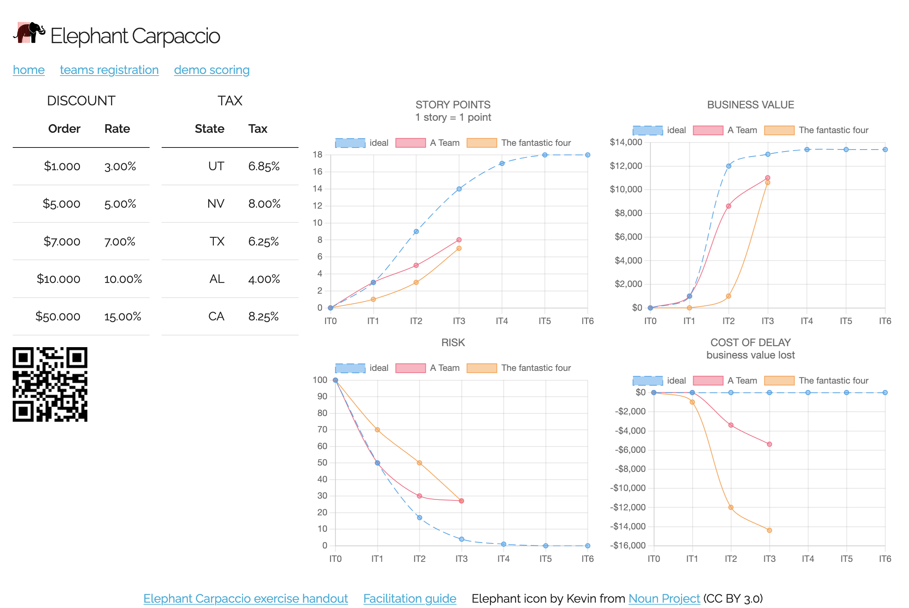
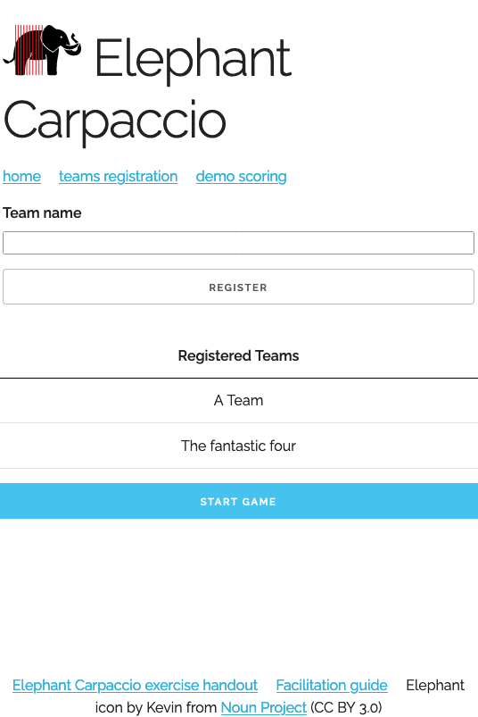
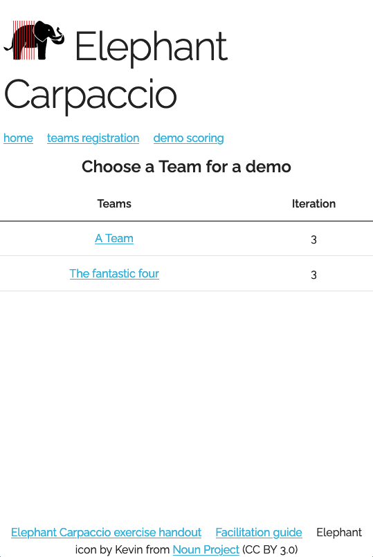

# Elephant Carpaccio

This project proposes to gamify the Alistair Cockburn's workshop: the Elephant Carpaccio



## Install

Clone this repository.
Then run the main.go

```shell
git clone 
cd elephant-carpaccio
go run main.go

```

Open your favorite browser to http://localhost:3000

## Usage

### The board

The board is at http://localhost:3000

Each team can compare his curve to the ideal one.

If you scan, as a facilitator, the QRCode with your smartphone, you'll be redirected to the Demo page. You have to be on the same network of your machine as the url start with the local IP of your machine.

### Register Teams

Go to http://localhost:3000/register

Enter the name of each team.



### Demo Time

Go to http://localhost:3000/demo

Choose a Team.
Then check all the features that are done.
Don't forget to validate.



## TODO

[Todo list](TODO.md)

## License

[GNU GPLv3](https://choosealicense.com/licenses/gpl-3.0/)